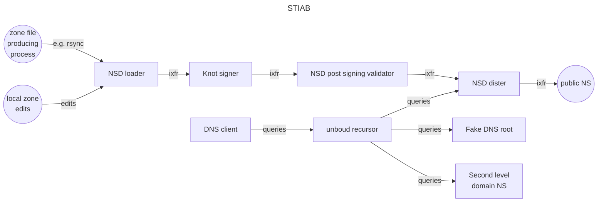

# Stiab: DNSSEC Signer street-in-a-box

> Stiab (/stee-ab/). The name is an attempt at humorous "Dunglish" (Dutch wrongly translated into English).  
> In Dutch the word for street (straat) can be used to describe a series of connected or ordered items, like a straight in poker or in a game of dice.  
> Here we create a straight of interconnected nameservers.

## Goal:
Deploy a chain of nameservers creating a signed TLD DNS zone that can be DNSSEC validated with dig, delv, drill and dnsviz via a recursor.  
Based on Ubuntu, Docker (build/compose), NSD, Knot, Unbound, DNSviz, etc.  
We are taking the perspective of a DNS registry (keeper of a DNS top level domain, in other words: a ccTLD or gTLD (or sTLD/tTLD))
This means that the levels above and below (DNS root and DNS lower levels) are simplified.

After you have cloned this repo, you should be able to just run `docker compose up -d --build` and get a working dnssec signing setup.
Provided your host has Git and Docker (see below for guidance).
(TL;DR see the TL;DR file in this repo)
If you already know wat you want, you can alter configs beforehand (e.g. choose a faster dnssec policy in files/knot-signer/knot.conf to really get those keys rolling!).

Once up and running you can start altering configs, zonefiles and even swap out or add whole components.
The preferred way of working is to not make changes in the running containers, but on the files you got by cloning this repository and doing a `docker compose down` and `docker compose up -d --build` again.
This should hopefully satisfy your testing and designing needs.

## Config files
A complete set of working config files is included in this repository. For now these files are handcrafted.  
The actions for handcrafting are included below, so you could start from scratch if you like that kind of thing.  
*TODO*: more automation in creating the config files.

### W.I.P alert
> [!CAUTION]
> At the moment this should be considered work in progress.    
> Use this software at your own risk.  
> * especially the zones TTL's and KASP policies may not be fully atuned.  
> * inconsistencies between components did happen. *TODO*: /var/lib/stiab -> /var/lib/nsd ?  
> * maybe Knotd should be running as root in stead of user knot? Or NSD as user nsd?   
> * nameserver configs are still unoptimized and bare bones  
> * we have no TSIGs.  
> * Also see the issues of this repo.

## DNSSEC keys and validation
This signing setup cannot use the actual DNSSEC signing keys for the DNS root of course, and instead uses our own DNSSEC root signing keys.
The added TLD ".tld" also uses its own DNSSEC signing keys.
To include the new TLD delegation in a DNS root zone, a fake dns rootserver is included.
This server is a "self contained" dnssec signer, that serves the "november 2024" root zone containing all existing TLDs, and any we invented ourselves.
For DNSSEC validation to work this root zone is DNSSEC *resigned* with our own signing keys.  
A specially prepared Unbound DNSSEC validating recursive nameserver is started that knows about the fake DNS root and trusts its DNSSEC signing keys, instead of the real root zone and trust-anchor. Please note: because of the resigning of the DNS root, all existing TLDs, and any we invented ourselves can be used with this recursor.  
To do validations a dns-client container, with dig, drill, delv and DNSviz is also started. To enter it: `docker exec -it stiab-dns-client-1 bash` (Or see below for some more guidance and example commands).

## Zonefile
You can/should supply an unsigned tld.zone file of your own making. A small working tld.zone is supplied as an example.  
To run a realistic setup, this tld.zone should be supplied often and with a realistic number of changes.
Also for extra validation realism: a DNSSEC signing second level nameserver is started that serves the sidn.tld zone. Feel free to change its name and zonefile.

## Components
|  name          |   function                                                                                                                                                                 |
|----------------|-------------------------------------------------------------------------------------------------------------------------|
|nsd-zoneloader  |Loads unsigned zone of your TLD, supplies XFRs and notifies to the next in line nameserver: knot-signer. Please note: the verifier mechanism of NSD is not configured at this host, as it only applies to incoming XFRs, and not to zones configured as primary on this host.|
|knot-signer     |DNSSEC signer for TLD, supplies IXFRs to the next in line nameserver: nsd-post-validator|
|nsd-post-validator   |Does DNSSEC validation and supplies IXFRs to the next in line nameserver: nsd-dister. Please note: the validation/verifier mechanism of NSD only applies to incoming XFRs|
|nsd-dister      |Hidden primary that could theoretically supply IXFRs to your (anycasted) public nameserver setup. However, in this setup it functions as the source of authority for our own TLD. As such it is included as an NS for .tld in the (fake) root.zone|
|unbound-recursor|Fake dns rooted recursor that enables validation with dig, delv, drill, dnsviz. We need that CD bit!!! root-hints: knot-fakeroot only, trust-anchor is our own .tld ksk's DS|
|knot-fakeroot   |Fake dns rootserver, serves a dnssec-stripped, then dnssec resigned (with own keys) root.zone. This root.zone contains your TLD's (A, NS, DS) records.|
|dns-client      |Here we do our digging, drilling, delving, vizzing.|
|knot-secondlevel|Nameserver to serve a secondlevel domain under your TLD, it adds realism to your validations|

## Serials
**NOTE**: files/nsd-zoneloader/zones/tld.zone holds the pre-signing serial (in the logging named as "remote serial"). Update this serial if you change the tld.zone file. After updating the zone file: `docker exec stiab-nsd-zoneloader-1 nsd-control reload tld`  
**NOTE**: knot-signer will sign, and thus increase the serial, but this is a separate serial from the pre-signing serial. The main reason for knot-signer to keep this separate serial is that RRSIGs expire and need regeneration, wether you changed the unsigned zone or not.  
**NOTE**: repeated docker compose up/down's will repeatedly increment the post signing serial. This is because we keep the /var/lib/knot/keys/\*.mdb between restarts. Why not remove these files? Because this would also result in creating new keys at every docker compose up (and thus a new DS in the root dns zone, and the recursor). This is too inconvenient at the moment, with the configs being handcrafted. Another consequence of keeping Knotds \*.mdb files between restarts is that DNSSEC key roll times do not reset. They are linked to the key age from key creationwhich is recorded in the \*.mdb files. This means that an unexpected (but harmless) ZSK key roll could start immediately after deploy. This is for example visible as an extra zsk in DNSviz. Do not remove this extra key, Knotd is planning on using it in the near future.   

# Preparations before deployment
## host
If running on real hardware or a dedicated host is impractical, you can use your favorite local virtualization tooling. Mine is Incus.

    sudo -i
    incus launch images:ubuntu/noble --vm stiab-vm
    incus shell stiab-vm
    apt-get update && apt-get upgrade -y

## Install Git
Should your host not have git already:   
`apt-get update && apt-get install git   # or possibly git-core`

## Install docker-ce
(Source: adapted from [https://docs.docker.com/engine/install/ubuntu/](https://docs.docker.com/engine/install/ubuntu/))  

Add Docker's official GPG key:

    apt-get install -y ca-certificates curl
    curl -fsSL https://download.docker.com/linux/ubuntu/gpg -o /etc/apt/keyrings/docker.asc
    chmod a+r /etc/apt/keyrings/docker.asc

Add the repository to Apt sources:

    echo \
    "deb [arch=$(dpkg --print-architecture) signed-by=/etc/apt/keyrings/docker.asc] https://download.docker.com/linux/ubuntu \
    $(. /etc/os-release && echo "$VERSION_CODENAME") stable" | \
    sudo tee /etc/apt/sources.list.d/docker.list > /dev/null
    
    apt-get update
    apt-get upgrade -y
    apt-get install -y docker-ce docker-ce-cli containerd.io docker-buildx-plugin docker-compose-plugin

## Start docker service
`systemctl start docker`   
OR (for persistent docker service)   
`systemctl enable --now docker`

# Deploy
## pull and build/start
    git clone https://github.com/niek-sidn/stiab.git
    cd stiab
    docker compose up -d --build
    docker compose logs
    # Hint: do a git status, and see which files changed,
    # look at the ./entrypoints/* scripts to see which of these changes will survive a compose down and up

## Prove it works
    docker exec -it stiab-dns-client-1 bash
#### Dig/Drill/Delv
    dig +multi +dnssec soa . @172.20.0.15
    dig +multi +dnssec soa tld. @172.20.0.15
    dig +multi +dnssec soa nl. @172.20.0.15
    dig +multi +dnssec soa sidn.tld. @172.20.0.15
    dig +multi +dnssec soa sidn.nl. @172.20.0.15
    dig +multi +dnssec soa doesntexist.tld. @172.20.0.15
    dig +multi +dnssec soa brokendnssec.net. @172.20.0.15
    dig +multi +dnssec soa brokendnssec.net. @172.20.0.15 +cdflag
    drill -S tld. @172.20.0.15 soa
    drill -S sidn.tld. @172.20.0.15 soa
    drill -k /var/lib/dns/conf/root.key -r /var/lib/dns/conf/fake-root.hints -T . @172.20.0.15 soa
    drill -k /var/lib/dns/conf/root.key -r /var/lib/dns/conf/fake-root.hints -T tld. @172.20.0.15 soa
    drill -k /var/lib/dns/conf/root.key -r /var/lib/dns/conf/fake-root.hints -T nl. @172.20.0.15 soa
    drill -k /var/lib/dns/conf/root.key -r /var/lib/dns/conf/fake-root.hints -T sidn.tld. @172.20.0.15 soa
    drill -k /var/lib/dns/conf/root.key -r /var/lib/dns/conf/fake-root.hints -T sidn.nl. @172.20.0.15 soa
    drill -k /var/lib/dns/conf/root.key -r /var/lib/dns/conf/fake-root.hints -T doesntexist.tld. @172.20.0.15 soa
    drill -k /var/lib/dns/conf/root.key -r /var/lib/dns/conf/fake-root.hints -T brokendnssec.net. @172.20.0.15 soa
    delv +vtrace -a /var/lib/dns/conf/root.key-delv @172.20.0.15 tld. soa
    delv +vtrace -a /var/lib/dns/conf/root.key-delv @172.20.0.15 nl. soa
    delv +vtrace -a /var/lib/dns/conf/root.key-delv @172.20.0.15 sidn.tld soa
    delv +vtrace -a /var/lib/dns/conf/root.key-delv @172.20.0.15 sidn.nl soa
    delv +vtrace -a /var/lib/dns/conf/root.key-delv @172.20.0.15 doesntexist.tld. soa
    delv +vtrace -a /var/lib/dns/conf/root.key-delv @172.20.0.15 brokendnssec.net. soa +cdflag

#### DNSviz
    cd root/dnsviz/ && . bin/activate
    dnsviz probe -4 -p -s 172.20.0.15 sidn.tld. > /var/lib/dns/results/sidn.tld.json
    dnsviz probe -4 -p -s 172.20.0.15 sidn.nl. > /var/lib/dns/results/sidn.nl.json
    dnsviz probe -4 -p -s 172.20.0.15 doesntexist.tld. > /var/lib/dns/results/doesntexist.tld.json
    dnsviz print -P -r /var/lib/dns/results/sidn.tld.json -t /var/lib/dns/conf/root.key
    dnsviz print -P -r /var/lib/dns/results/sidn.nl.json -t /var/lib/dns/conf/root.key
    dnsviz print -P -r /var/lib/dns/results/doesntexist.tld.json -t /var/lib/dns/conf/root.key
    dnsviz graph -Tpng -P -r /var/lib/dns/results/sidn.tld.json -o /var/lib/dns/results/sidn.tld.png -t /var/lib/dns/conf/root.key
    dnsviz graph -Tpng -P -r /var/lib/dns/results/sidn.nl.json -o /var/lib/dns/results/sidn.nl.png -t /var/lib/dns/conf/root.key
    dnsviz graph -Tpng -P -r /var/lib/dns/results/doesntexist.tld.json -o /var/lib/dns/results/doesntexist.tld.png -t /var/lib/dns/conf/root.key
    dnsviz graph -Thtml -P -r /var/lib/dns/results/sidn.tld.json -o /var/lib/dns/results/sidn.tld.html -t /var/lib/dns/conf/root.key
    dnsviz graph -Thtml -P -r /var/lib/dns/results/sidn.nl.json -o /var/lib/dns/results/sidn.nl.html -t /var/lib/dns/conf/root.key
    dnsviz graph -Thtml -P -r /var/lib/dns/results/doesntexist.tld.json -o /var/lib/dns/results/doesntexist.tld.html -t /var/lib/dns/conf/root.key
    cp ./share/dnsviz/js/dnsviz.js /var/lib/dns/results/
    cp ./share/dnsviz/css/dnsviz.css /var/lib/dns/results/

Now get the resulting files to a host that can display pictures and run a browser.  
If you are using an incus/lxd VM pull the files to your laptop:
    
    incus file pull stiab-vm/root/stiab/files/dns-client/results/sidn.tld.png /root/Downloads/
    incus file pull stiab-vm/root/stiab/files/dns-client/results/sidn.nl.png /root/Downloads/
    incus file pull stiab-vm/root/stiab/files/dns-client/results/doesntexist.tld.png /root/Downloads/
    incus file pull stiab-vm/root/stiab/files/dns-client/results/dnsviz.js /root/Downloads/
    incus file pull stiab-vm/root/stiab/files/dns-client/results/dnsviz.css /root/Downloads/
    incus file pull stiab-vm/root/stiab/files/dns-client/results/sidn.tld.html /root/Downloads/
    incus file pull stiab-vm/root/stiab/files/dns-client/results/sidn.nl.html /root/Downloads/
    incus file pull stiab-vm/root/stiab/files/dns-client/results/doesntexist.tld.html /root/Downloads/
    cd /root/Downloads/
    ristretto sidn.tld.png
    sed -i "s#file:///root/dnsviz/share/dnsviz/css/dnsviz.css#dnsviz.css#" /root/Downloads/sidn.tld.html
    sed -i "s#file:///root/dnsviz/share/dnsviz/js/dnsviz.js#dnsviz.js#" /root/Downloads/sidn.tld.html
    firefox sidn.tld.html
    
## Zone changes (on your docker host)
    # sidn.tld on knot-secondlevel (changes and resulting DNSSEC signatures will survive compose down and up)
    vim files/knot-secondlevel/zones/sidn.tld.zone
    docker exec stiab-knot-secondlevel-1 knotc zone-reload sidn.tld
    docker exec stiab-knot-secondlevel-1 knotc zone-status sidn.tld
    docker exec stiab-knot-secondlevel-1 keymgr sidn.tld list -e iso

    # . on knot-fakeroot (changes and resulting DNSSEC signatures will survive compose down and up)
    vim files/knot-fakeroot/zones/root.zone
    docker exec stiab-knot-fakeroot-1 knotc zone-reload .

    # unsigned .tld on nsd-zoneloader (changes will survive compose down and up, DNSSEC signatures will not)
    vim files/nsd-zoneloader/zones/tld.zone
    docker exec stiab-nsd-zoneloader-1 nsd-control reload tld
    docker exec stiab-knot-signer-1 knotc zone-status tld
    docker exec stiab-knot-signer-1 keymgr tld list
    docker exec stiab-knot-signer-1 keymgr tld list -e iso

# Create your own config files by hand
## Steps to create configs/zones/keys should you want to roll your own
**NOTE**: Only needed if you do *not* want to use the provided (and fully functional!) example configs.  
Use the files in the repository for guidance.

    mkdir stiab && cd stiab
    mkdir dockerfiles entrypoints files
    vim compose.yml   # or do this as a last step

## knot-secondlevel
    mkdir files/knot-secondlevel
    mkdir files/knot-secondlevel/zones files/knot-secondlevel/journal
    vim files/knot-secondlevel/knot.conf
    docker build -t knotd-stiab:latest -f dockerfiles/Dockerfile.knotd .
    docker run --rm -it --entrypoint bash -v ./files/knot-secondlevel/knot.conf:/etc/knot/knot.conf:ro -v ./files/knot-secondlevel/keys:/var/lib/knot/keys:rw -v ./files/knot-secondlevel/zones:/var/lib/knot/zones:rw -v ./files/knot-secondlevel/journal:/var/lib/knot/journal:rw knotd-stiab:latest

    chown --recursive knot:knot /var/lib/knot
    keymgr sidn.tld generate algorithm=13 ksk=yes zsk=no
    keymgr sidn.tld generate algorithm=13 ksk=no zsk=yes
    keymgr sidn.tld ds | grep '13 2' > /var/lib/knot/keys/ds.sidn.tld   # for tld zone
    exit

## nsd-zoneloader
    mkdir files/nsd-zoneloader
    mkdir files/nsd-zoneloader/zones files/nsd-zoneloader/keys
    vim files/nsd-zoneloader/nsd.conf   # Note: zones and key/cert files under /var/lib/stiab/
    vim files/nsd-zoneloader/zones/tld.zone  # include files/knot-secondlevel/keys/ds.sidn.tld and sidn.tld NS and glue
    vim dockerfiles/Dockerfile.nsd
    docker build -t nsd-stiab:latest -f dockerfiles/Dockerfile.nsd .
    docker run --rm -it --entrypoint bash -v ./files/nsd-zoneloader/nsd.conf:/etc/nsd/nsd.conf:ro -v ./files/nsd-zoneloader/keys:/var/lib/stiab/keys:rw nsd-stiab:latest

    nsd-control-setup -d /var/lib/stiab/keys/
    exit

## knot-signer
    mkdir files/knot-signer
    mkdir files/knot-signer/zones files/knot-signer/journal
    vim files/knot-signer/knot.conf
    # (files/knot-signer/zones/tld.zone is created automatically after notify from nsd-zoneloader)
    # (if not hostname == knot-fakeroot/knot-secondlevel: entrypoint_knotd.sh removes all files/knot-signer/zones files/knot-signer/journal content)
    vim dockerfiles/Dockerfile.knotd
    # (using the same docker image as knot-secondlevel so no build here)
    docker run --rm -it --entrypoint bash -v ./files/knot-signer/knot.conf:/etc/knot/knot.conf:ro -v ./files/knot-signer/keys:/var/lib/knot/keys:rw -v ./files/knot-signer/zones:/var/lib/knot/zones:rw -v ./files/knot-signer/journal:/var/lib/knot/journal:rw knotd-stiab:latest

    chown --recursive knot:knot /var/lib/knot
    keymgr tld generate algorithm=13 ksk=yes zsk=no
    keymgr tld generate algorithm=13 ksk=no zsk=yes
    keymgr tld ds | grep '13 2' > /var/lib/knot/keys/ds.tld   # for root zone
    exit

## knot-fakeroot
    mkdir files/knot-fakeroot
    mkdir files/knot-fakeroot/zones files/knot-fakeroot/journal
    vim files/knot-fakeroot/knot.conf
    # (using the same docker image as knot-secondlevel so no build here)
    docker run --rm -it --entrypoint bash -v ./files/knot-fakeroot/knot.conf:/etc/knot/knot.conf:ro -v ./files/knot-fakeroot/keys:/var/lib/knot/keys:rw -v ./files/knot-fakeroot/zones:/var/lib/knot/zones:rw -v ./files/knot-fakeroot/journal:/var/lib/knot/journal:rw knotd-stiab:latest

    chown --recursive knot:knot /var/lib/knot
    keymgr . generate algorithm=13 ksk=yes zsk=no
    keymgr . generate algorithm=13 ksk=no zsk=yes
    keymgr . ds | grep '13 2' > /var/lib/knot/keys/ds.root   # for unbound trust anchor
    for KEYID in $(keymgr . list | awk '{print $2}'); do keymgr . dnskey $KEYID; done > /var/lib/knot/keys/dnskey.root   # for root zone
    exit

#### Now create an unsigned root zone file for adding TLDs and resigning
    curl -s https://www.internic.net/domain/root.zone | sed -f prepare_root_zone.sed > files/knot-fakeroot/zones/root.zone
    OR (manually):
    curl https://www.internic.net/domain/root.zone > files/signed-root.zone
    cp files/signed-root.zone files/unsigned-root.zone
    # NOTE: leaving arpa. for 172.20.0.0/24 alone.
    vim files/unsigned-root.zone
    :g/IN\sRRSIG/d                                           # remove all RRSIGs
    :g/IN\sNSEC/d                                            # remove all NSEC
    :g/^\.\s.*IN\sZONEMD/d                                   # remove root's ZONEMD
    :g/^\.\s.*IN\sDNSKEY/d                                   # remove root's DNSKEY (so need to supply our own)
    :%s/a.root-servers.net./a.root-servers.tld./             # avoid confusion by using own tld
    :g/^a.root-servers.tld.\s.*AAAA/d                        # no ipv6 at the moment...
    :g/^\.\s.*\sIN\sNS\s.\.root-servers\.net\.$/d            # remove all root-servers.net NS's so only a.root-servers.tld left
    :%s/nstld.verisign-grs.com./hostmaster./                 # replace SOA mail address to avoid confusion
    :%s/1800 900 604800 86400/900 60 3600 60/                # replace SOA timings
    :%s/^\(a.root-servers.tld.\s.*\sA\s\).*/\1172.20.0.13/   # replace ipv4 address of a.root-servers.tld (formally a.root-servers.net)
    :2
    :r files/knot-fakeroot/keys/dnskey.root
    :4
    o
    tld.                    172800  IN      NS      ns1.nic.tld.
    tld.                    86400   IN      DS      54231 13 2 b2c729851fbf44105868c94fbfd98a79cc63992f63acd03d3fd25b873dd294b5 # files/knot-signer/keys/ds.root
    ns1.nic.tld.            172800  IN      A       172.20.0.14
    cp files/unsigned-root.zone files/knot-fakeroot/zones/root.zone

## nsd-post-validator
    mkdir files/nsd-post-validator
    mkdir files/nsd-post-validator/zones files/nsd-post-validator/keys
    vim files/nsd-post-validator/nsd.conf   # Note: zones and key/cert files under /var/lib/stiab/
    # (files/nsd-post-validator/zones/tld.zone is created automatically after notify from knot-signer)
    # (using the same docker image as nsd-zoneloader so no build here)
    docker run --rm -it --entrypoint bash -v ./files/nsd-post-validator/nsd.conf:/etc/nsd/nsd.conf:ro -v ./files/nsd-post-validator/keys:/var/lib/stiab/keys:rw nsd-stiab:latest

    nsd-control-setup -d /var/lib/stiab/keys/
    exit

## nsd-dister
    mkdir files/nsd-dister
    mkdir files/nsd-dister/zones files/nsd-dister/keys
    vim files/nsd-dister/nsd.conf   # Note: zones and key/cert files under /var/lib/stiab/
    # (files/nsd-dister/zones/tld.zone is created automatically after notify from nsd-post-validator)
    # (using the same docker image as nsd-zoneloader so no build here)
    docker run --rm -it --entrypoint bash -v ./files/nsd-dister/nsd.conf:/etc/nsd/nsd.conf:ro -v ./files/nsd-dister/keys:/var/lib/stiab/keys:rw nsd-stiab:latest

    nsd-control-setup -d /var/lib/stiab/keys/
    exit

## unbound-recursor
    mkdir files/unbound-recursor
    mkdir files/unbound-recursor/conf
    vim files/unbound-recursor/conf/fake-root.hints
    vim files/unbound-recursor/conf/unbound.conf
    vim files/unbound-recursor/conf/unbound.conf.d
    vim files/unbound-recursor/conf/unbound.conf.d/remote-control.conf
    vim files/unbound-recursor/conf/unbound.conf.d/base.conf  # trust-anchor: see: cat files/knot-fakeroot/keys/dnskey.root | grep '.\sDNSKEY\s257.*'
    docker build -t unbound-stiab:latest -f dockerfiles/Dockerfile.unbound . &&  docker system prune -f && docker buildx prune -f
    docker run --rm -it --entrypoint bash -v ./files/unbound-recursor/conf:/etc/unbound/:rw unbound-stiab:latest

    unbound-control-setup
    exit

## dns-client
    mkdir files/dns-client
    mkdir files/dns-client/conf files/dns-client/results
    cat files/knot-fakeroot/keys/dnskey.root | grep '.\sDNSKEY\s257.*' > files/dns-client/conf/root.key
    vim files/dns-client/conf/root.key-delv  # same root.key, but differently packaged
    cp files/unbound-recursor/conf/fake-root.hints files/dns-client/conf/
    docker build -t dnsclient-stiab:latest -f dockerfiles/Dockerfile.dnsclient . &&  docker system prune -f && docker buildx prune -f
    # NOTE: if you are only interested in DNSviz output, you could maybe also use their official Docker image: https://github.com/dnsviz/dnsviz.
    # (a docker run serves no purpose here, after docker compose up -d do your dig/drill/delv-thang (see above))

# EOF

